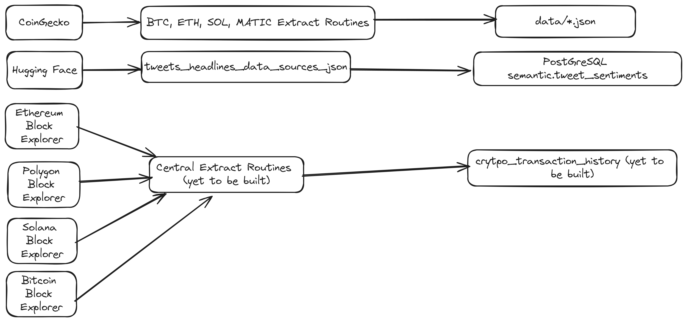
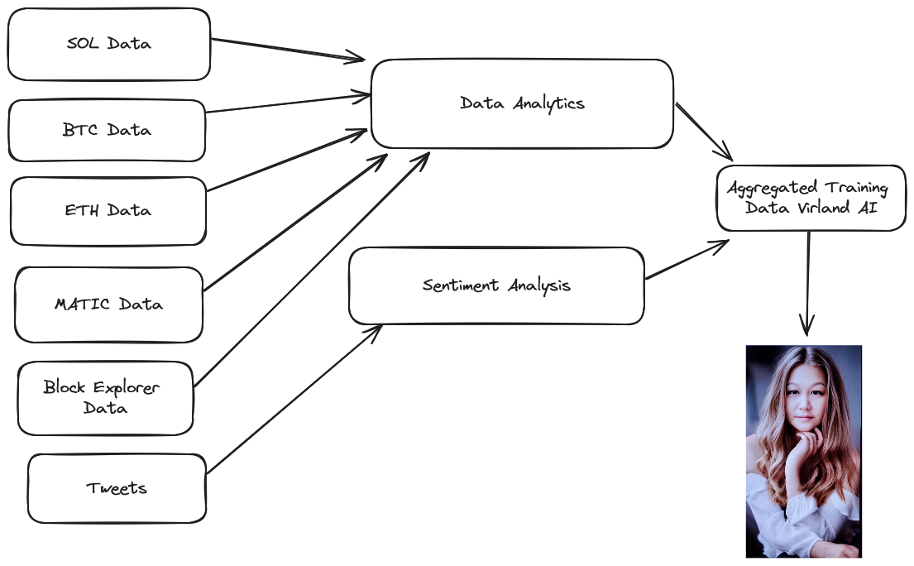

# Overview

Virland Financials is a financial research application meant to help investors from individual to  institutions.  Virland Financials aims to provide rich financial data at no cost and some features at an affordable price.  Virland Financials provides data analytics and sentiment data for each crypto assets it supports.  Virland AI provides assistance to the investor and help investors to make informative decisions.  Virland AI uses all the financial data that has been aggregated making Virland a subject matter expert in Crypto Currency Investment.

# Data Engineering

## Data Producers Flow

## Virland AI Aggregated AI Training Data

## Watch the video

# Data Extraction of Crypto Assets

1. btc_analytics\extractroutines
    * This routines will extract from CoinGecko from the most recent record to current - btc_extract_exchange_data.py
    * This extract can be run if you need the current date back an entire year - btc_yearly_extract_exchange_data.py
2. eth_analytics\extractroutines
    * This routines will extract from CoinGecko from the most recent record to current - eth_extract_exchange_data.py
    * This extract can be run if you need the current date back an entire year - eth_yearly_extract_exchange_data.py
3. sol_analytics\extractroutines
    * This routines will extract from CoinGecko from the most recent record to current - sol_extract_exchange_data.py
    * This extract can be run if you need the current date back an entire year - sol_yearly_extract_exchange_data.py
4. matic_analytics\extractroutines
    * This routines will extract from CoinGecko from the most recent record to current - matic_extract_exchange_data.py
    * This extract can be run if you need the current date back an entire year - matic_yearly_extract_exchange_data.py

# Sentiment Analysis

semantics\extractroutines
    * This extract routine takes it sources from Hugging face and saves the tweets in JSON format - tweets_headlines_data_source_json.py
    * This routine takes the raw tweets data and cleans the data for further processing that is used for Virland training data - process_tweets_data.py

